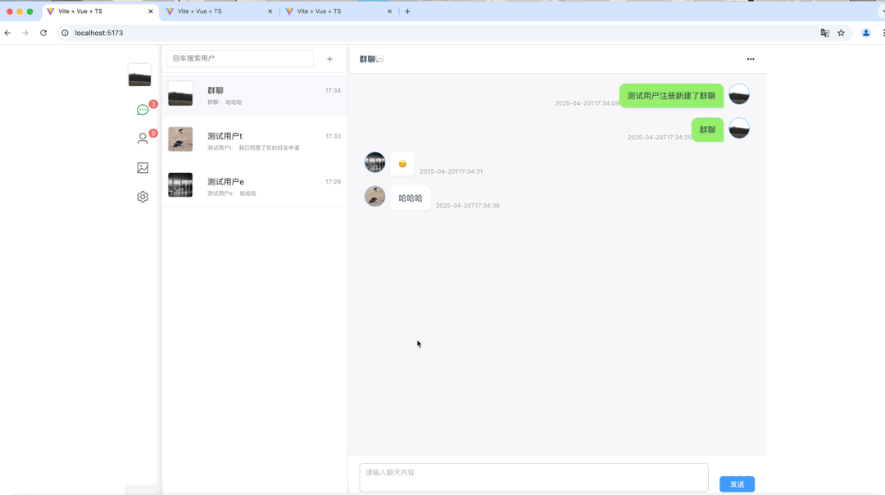
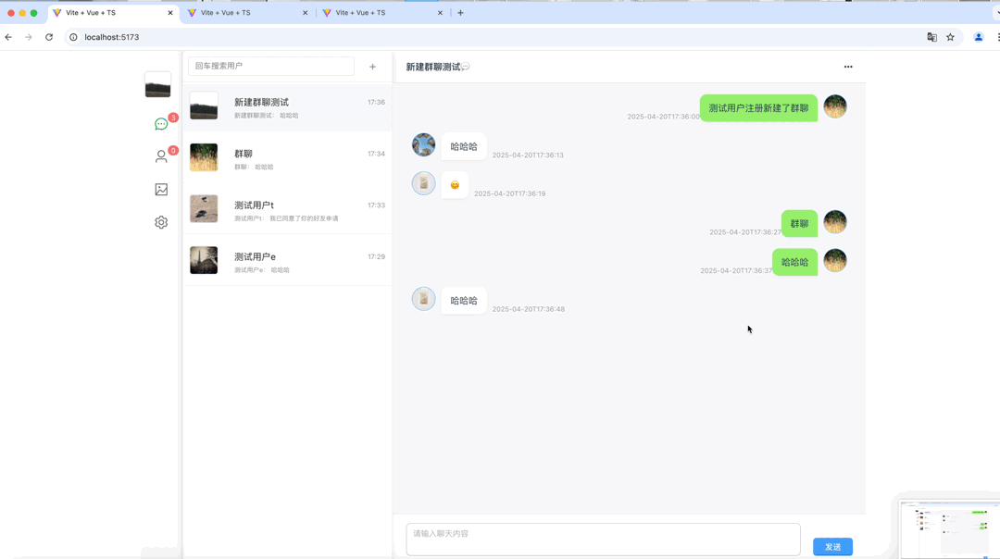
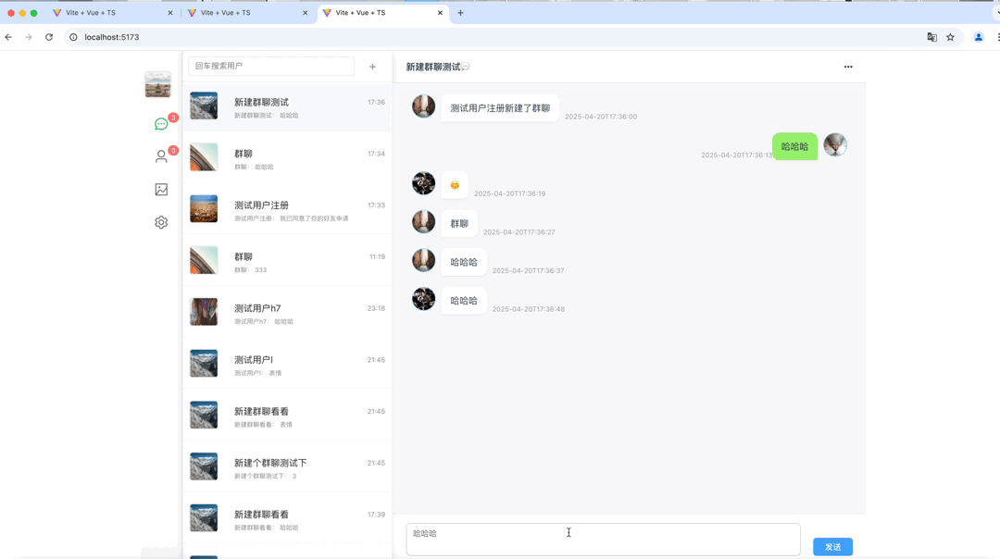

# kChat_web
本项目为即时通讯软件仿微信聊天项目前端，由Springboot+vue3+mysql+websocket实现，功能参考微信等聊天软件设计
聊天服务前端
- 本项目为即时聊天服务的前端，由Springboot+vue3+mysql+websocket实现，功能参考微信等聊天软件设计

- 业务架构

- 技术栈
    - 后端
        - 选用编程语言 Java
        - web框架SpringBoot
        - db MySQL 持久存储
        - nosql 缓存 Redis
        - 全双工通信框架 WebSocket
    - 前端
        - 前端框架Vue3
        - Typescript
        - UI样式 Css、ElementPlus
        - 网页路由 vue-router
        - 全双工通信框架Websocket
- 已实现功能
    - 用户登录
    - 用户注册
    - 加好友
    - 删除好友
    - 拉黑好友
    - 好友搜索与列表
    - 发起群聊
    - 消息单聊
    - 群聊
    - 群成员列表模块
    - 用户信息查看
- 未实现功能
    - 聊天消息模块
        - 消息提醒
        - 群公告
        - 群成员权限管理
        - 视频/图片/文件消息发送
        - 语音通话
        - 视频通话
    - 好友与通讯录模块
        - 星标联系人
        - 群邀请与分享
    - 全局搜索模块
    - 智能机器人模块
    - 直播模块
    - 额外功能

项目演示
可参考顶级目录下的 即时通讯项目.mp4
- 未登录重定向
  
- 用户注册
  
- 用户密码登录
  
- 用户验证码登录
  
- 加好友请求
  
- 单聊
  
- 群聊
  
- 群设置
  
- 单聊好友设置
  
- 最后发送消息列表与消息内容
  

- 项目部署
  - 下载依赖资源 npm -i
  - 部署 npm run dev
- 本项目后端地址：https://github.com/enjoykanyu/chat_serve
最后
- 觉得项目不错的话，欢迎star支持下，感谢🫰
- 对于项目有任何问题欢迎提问和提issue
- 同时欢迎对本项目push贡献